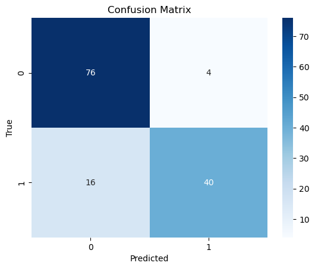
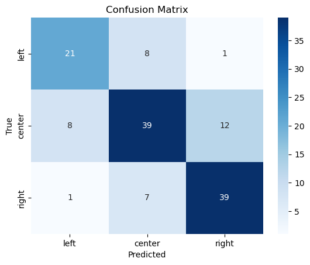

# Supervised Learning to Classify Political Parties Ideological Positions

## Overview

This repository presents a supervised machine learning approach to classify European political parties’ ideological positions using manifesto texts from The Manifesto Project and ideological scores from the Chapel Hill Expert Survey (CHES). The project explores text preprocessing, feature engineering, and model performance for ideological classification.

## Setup

- **Datasets**: Manifesto Project (English and translated manifestos) and CHES ideological scores.
- **Tools**: Python (pandas, scikit-learn, spaCy), R (manifestoR).
- **Preprocessing**: Lemmatization, stopword removal, TF-IDF vectorization.
- **Models**: Linear Regression, Random Forest, LightGBM.

## Approach

- Extracted and cleaned manifesto texts, merging with CHES scores by year and party.
- Preprocessed texts using lemmatization and TF-IDF for feature representation.
- Trained models for regression (continuous scores) and classification (left/center/right).
- Evaluated models with accuracy and confusion matrices, focusing on two- and three-group classification.

## Key Insights

- **Classification Success**: LightGBM achieved 85% accuracy for left/right classification, outperforming Random Forest (80%).
- **Three-Group Challenge**: Accuracy dropped to 71% for left/center/right due to nuanced ideological boundaries.
- **Feature Importance**: Terms like “poverty” and “immigration” were key predictors, avoiding overfitting to party-specific terms.
- Lemmatization preserved semantic meaning, enhancing model interpretability.

## Limitations

- Bag-of-words misses contextual nuances; advanced methods like BERT could improve results.
- CHES scores introduce subjectivity; results may not generalize beyond European contexts.

## File Description
- `IdeologyClassification.ipynb`: Jupyter Notebook with data processing, model training, and visualizations.

